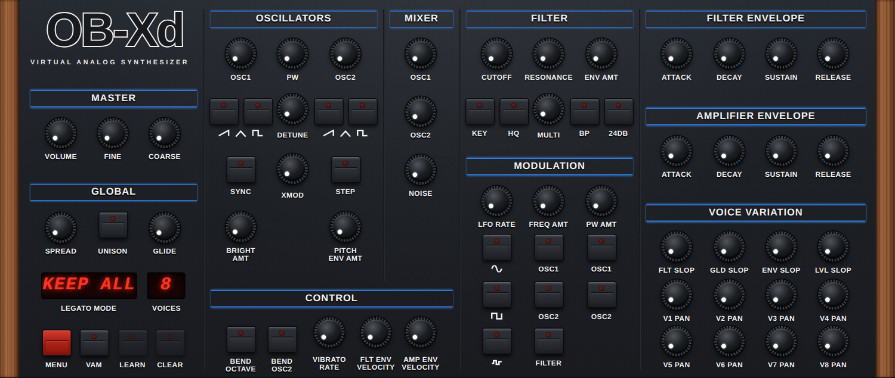
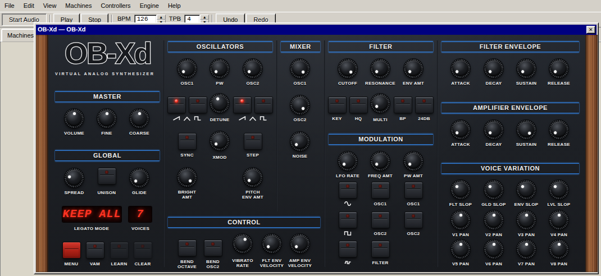

# OB-Xd WebCLAP

discoDSP OB-Xd 2.10 compiled as a direct WebCLAP (WCLAP) plugin, with its own
web editor.

This project compiles OB-Xd's JUCE-free synthesis engine to `wasm32` with
wasi-sdk and exposes it through the official CLAP C ABI. The editor is an HTML
page served through the `clap.webview/3` draft extension. There is no JUCE, no
CLAP helper framework, no Emscripten runtime and no host-specific JavaScript
bridge in the product: any WebCLAP host that implements `clap.gui` with the
`webview` window API can load it and open its editor. It is developed against
the buzz-remote WebCLAP backend in `prometheos-apps`.



The editor running inside buzz-remote (installed from `dist/OB-Xd.wclap.tar.gz`):



## Download

Every push to `main` builds the package and publishes it with a download page
on GitHub Pages (`.github/workflows/pages.yml`):

- page: https://dahlgrenmartin.github.io/prometheos-webclap-obxd/
- package (stable URL, installable by URL in a host):
  https://dahlgrenmartin.github.io/prometheos-webclap-obxd/OB-Xd.wclap.tar.gz

The archive is reproducible: it depends only on the bundle's bytes. The page
also serves the editor as a static preview under `editor/`. Publishing needs
**Settings → Pages → Source: GitHub Actions** once.

## Surface

- one stereo instrument output, no audio input;
- one note input accepting CLAP note events and MIDI (note on/off, pitch bend,
  mod wheel, sustain, all-notes/all-sound off, program change);
- all 77 OB-Xd engine parameters through `clap.params`, in panel order, with
  OB-Xd's own display text. The CLAP id of a parameter is its OB-Xd engine
  index (`ParamsEnum.h`), so ids are stable and match OB-Xd's program format;
- OB-Xd's 128-program bank through `clap.state`, in the exact byte format
  desktop OB-Xd writes (JUCE `copyXmlToBinary`), so state moves between the
  WCLAP and the desktop plugin unchanged;
- host tempo and beat position for the tempo-synced LFO;
- arbitrary host process sizes (the engine renders per sample, events are
  sample-accurate);
- `clap.gui` (embedded `webview` API) plus `clap.webview/3`: the editor's files
  are compiled into the module and served by `get_resource`, so the editor
  works whatever part of the bundle a host mounts.

Most parameters expose OB-Xd's normalized 0..1 value. Switches are stepped
0/1, and three selectors use natural units: **Voices** 1–32, **Legato Mode**
0–3 (Keep All, Keep Filter Envelope, Keep Amplitude Envelope, Retrig) and
**Coarse** −2..+2 octaves.

Not included: OB-Xd's MIDI learn, bank/preset files and skin loading, and
MTS-ESP microtuning (MTS-ESP needs a shared library in the host process; the
engine runs in 12-TET).

## Architecture

```text
WebCLAP host (e.g. buzz-remote)
  -> standard CLAP/WCLAP ABI
     -> ObxdClapPlugin            src/ObxdClapPlugin.cpp
        -> SynthEngine            vendor/obxd/Source/Engine (OB-Xd 2.10)
     -> clap.webview/3 editor     webui/ (embedded at build time)
```

The OB-Xd engine is header-only DSP. It reaches JUCE through a single include
in `SynthEngine.h`; `patches/obxd/0001-engine-juce-free-include.patch` points
that include at `src/ObxdJuceShim.h`, which supplies the handful of JUCE
utilities the engine uses (`jmin`, `jlimit`, `roundToInt`, `float_Pi`,
`zeromem` and JUCE's `Random` LCG). `src/MtsEspUnavailable.cpp` replaces the
MTS-ESP client with one that never finds a tuning master.

### Threads

Engine state is touched only on the audio thread while processing, and on the
main thread otherwise. Editor edits (main thread) reach the audio thread
through per-parameter atomics and return to the host as
`CLAP_EVENT_PARAM_GESTURE_BEGIN`/`PARAM_VALUE`/`GESTURE_END` output events.
Values the host automates, or a MIDI program change selects, are marked for
the editor and sent on the next `on_main_thread()` callback. A state load
while processing is handed to the audio thread for its next block.

### Editor protocol

The page and the plugin exchange one flat JSON object per message, as UTF-8
bytes in an `ArrayBuffer` (`window.parent.postMessage` / `message` events, per
`clap.webview/3`):

| direction | message |
|---|---|
| page → plugin | `{"type":"ready"}` |
| page → plugin | `{"type":"set","id":<clap id>,"value":<plain value>}` |
| page → plugin | `{"type":"gesture","id":<clap id>,"begin":true\|false}` |
| plugin → page | `{"type":"init","params":[{id,key,name,module,min,max,default,stepped,value,text}]}` |
| plugin → page | `{"type":"param","id":..,"value":..,"text":".."}` |

The page binds controls by OB-Xd's parameter keys (`Cutoff`, `Osc1Saw`, …).
Opened directly in a browser, it runs as a static preview.

## Pinned inputs

- OB-Xd: https://github.com/reales/OB-Xd @ `f1fcdd51eabcb7855cdd90818611cd7e357c359c` (2.10 release, GPL-3.0)
- CLAP headers: https://github.com/free-audio/clap @ `a47f6badb49d948fd009998f28309cdab78979c9`
- wasi-sdk: `wasi-sdk-34`

See [PROVENANCE.md](PROVENANCE.md) for checksums and license details.

## Build

```bash
git submodule update --init vendor/obxd vendor/clap
```

Set `WASI_SDK_PATH` to an extracted wasi-sdk 34 tree, then:

```bash
cmake -S . -B build-wasi -G Ninja \
  -DCMAKE_TOOLCHAIN_FILE="$WASI_SDK_PATH/share/cmake/wasi-sdk-p1.cmake" \
  -DWASI_SDK_PATH="$WASI_SDK_PATH" -DCMAKE_BUILD_TYPE=Release
cmake --build build-wasi --target package_wclap
```

Output:

```text
dist/
  OB-Xd.wclap/
    module.wasm
    LICENSE
  OB-Xd.wclap.tar.gz      # install this in a WebCLAP host (reproducible)
  OB-Xd.wclap.sha256
```

The module needs no wasm exception handling and imports only four WASI
preview1 functions.

## Using it in buzz-remote

With the WebCLAP backend of buzz-remote (`prometheos-apps`,
`apps/buzz-remote`), open **Machines → Plugins…**, install the package (the
Pages URL above with **Install URL**, or `dist/OB-Xd.wclap.tar.gz` with
**Install File…**), restart the audio engine, and add **OB-Xd** from
**Machines → New Machine → Generators → discoDSP**. Its parameters are
pattern columns and controller endpoints; double-click the machine (or use its
**Editor…** menu item) to open the web editor.

## Tests

```bash
cmake -S . -B build-native -G Ninja -DBUILD_NATIVE_TESTS=ON
cmake --build build-native
ctest --test-dir build-native --output-on-failure

node tests/wasm_contract.test.mjs dist/OB-Xd.wclap/module.wasm
```

The native tests drive the plugin only through the exported `clap_entry` and
the C ABI: lifecycle, parameters and text, desktop-compatible state, audio and
events, and the webview editor protocol.

## Experiments

[`experiments/boxedwine-vst`](experiments/boxedwine-vst/) is a proof of concept
that runs unmodified 32-bit Windows VST2/VST3 plugin binaries in the browser:
a Windows host program under Wine inside Boxedwine (an x86 emulator compiled to
WebAssembly), in the spirit of yabridge's Wine-side plugin host.
